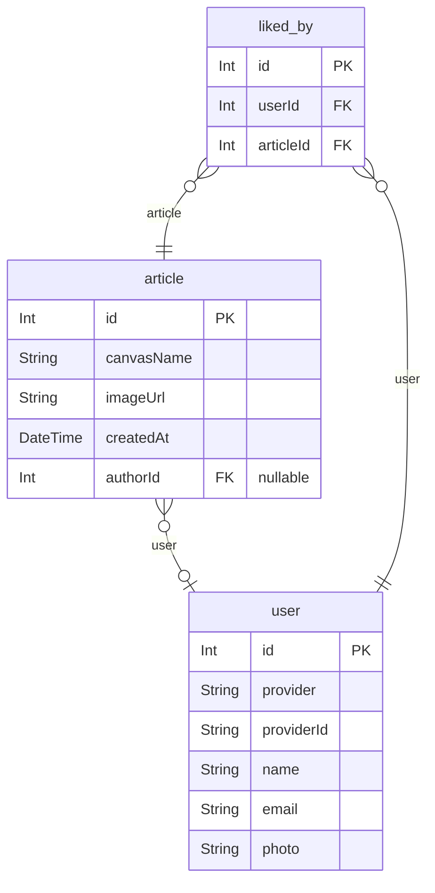

# [나만의 수야 수호 만들기](https://character-maker.l37.store/)

> 나만의 수야 수호 만들기는 삼육대학교 마스코트인 수야, 수호를 꾸밀 수 있는 프로그램입니다.

[API DOCS](https://character-maker-api.l37.store/api)

## Backend

### Tech

- nest.js
- postgresql
- redis
- typescript
- prisma

### 프로젝트 구조

### ERD

