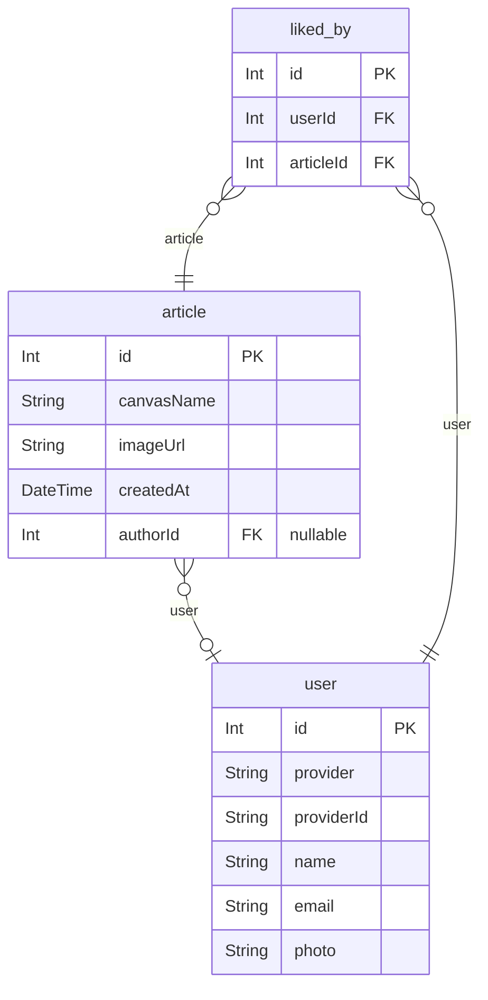

# ERD
> Generated by [`prisma-markdown`](https://github.com/samchon/prisma-markdown)

- [default](#default)

## default

### `article`

**Properties**
  - `id`: 
  - `canvasName`: 
  - `imageUrl`: 
  - `createdAt`: 
  - `authorId`: 

### `liked_by`

**Properties**
  - `id`: 
  - `userId`: 
  - `articleId`: 

### `user`

**Properties**
  - `id`: 
  - `provider`: 
  - `providerId`: 
  - `name`: 
  - `email`: 
  - `photo`: 